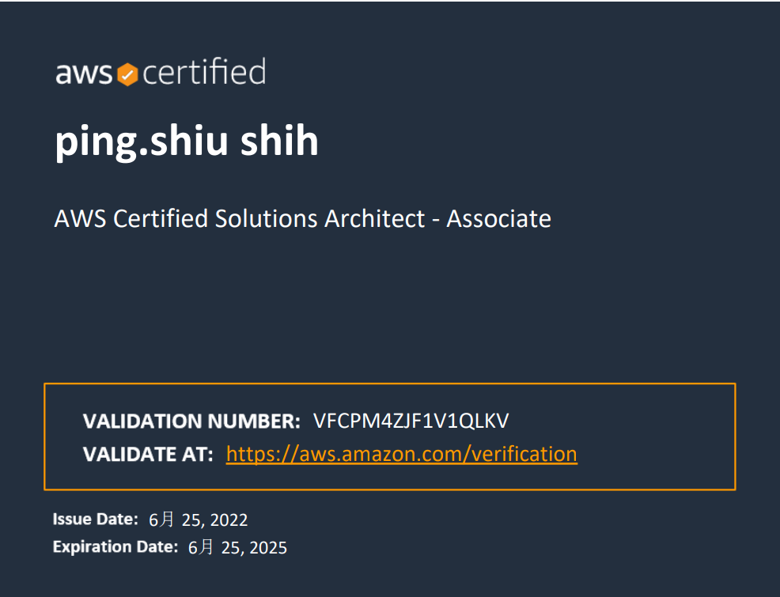
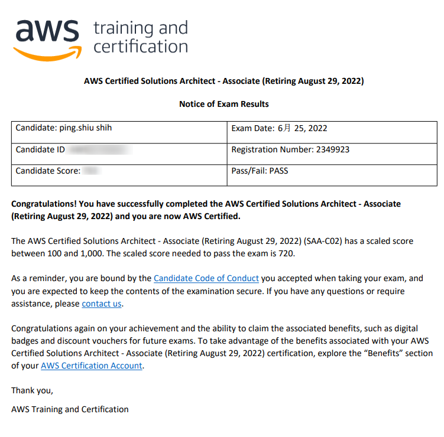

## 前言

我算是一個雲端小白，自從進入目前公司後才開始接觸雲端相關概念並感受到雲端服務威力

我會想參加 SSA 考試主要有下面幾個原因

1. 主要是想趕在 SAA-C02 (2022-08) 換考試範圍前來測驗
2. 感覺放在履歷上，增加職場競爭力
3. 驗收自己目前對於雲端相關知識
4. 目前在架構 Team 擔任工程師，希望規劃出好的系統架構



## 考試重點

### S3 (考試必考)

* S3 Standard
* S3 IA (Infrequent Access)
* Intelligent-Tiering：設計來優化成本，基於其自動移動 data 到相對便宜的 tier，不影響 performance，也不需提前處理。
* S3 One Zone-IA
* S3 Glacier：價格便宜，適合存放 Archive 檔案 (預設會加密)
  * Instant Retrieval：最少存放 90 天
  * Flexible Retrieval (formerly S3 Glacier)：最少存放 90 天
    * Expedited：1~5 min
    * Standard：3~5 hours
    * Bulk：5~12 hours
  * Deep Archive - for long term storage: 最少存放 180 天  
    * Standard：12 hours
    * Bulk：48 hours

#### 重點功能

S3 Lifecycle rule 控制 S3 存放物件存放規則 S3 Type，這樣可以讓S3使用費用更有效率

以下是 S3 type 使用 Lifecycle 轉換表 [lifecycle-transition-general-considerations](https://docs.aws.amazon.com/AmazonS3/latest/userguide/lifecycle-transition-general-considerations.html)


S3 Transfer Acceleration 啟用後擁有更快，簡單跨長距離資料交換

因為 S3 上傳有 5 GB 限制，如果要傳大型檔案可以使用 S3 multipart uploads 將檔案切分快速上傳，如果部分上傳失敗，只會針對部分重傳

### Storage 價格高到低

Standard > IA > Intelligent > IA One Zone > Glacier > Glacier Deep Archive

### S3 內容加解密

* SSE-S3: Key 存在 AWS S3 上，在 header 必須帶入 (`x-amz-server-side-encryption:AES256`)，由 AWS S3 管理

* SSE-KMS： Key 存在 AWS KMS 上，在 header 必須帶入 (`x-amz-server-side-encryption:AES256`)，可較好管控 key 使用權限，自行管理

* SSE-C：client Key 保存在 Client，提供 Data Key in Header 所以必須使用 Https

* Client Side Encryption：在 Client 加密並上傳

### S3 access logs

針對 S3 操作動作進行 audit log, 並可使用 athena 來查詢

### S3 Object Lock

必須啟用 versioning

> Version 一旦被啟動後只能被 suspended

### Use S3 Glacier vault 

Glacier Vault Lock 允許您使用保險庫鎖定策略輕鬆部署和實施單個 S3 Glacier 保險庫的合規性控制。

您可以在 Vault Lock policy 中指定諸如“一次寫入多次讀取”(WORM) 之類的控制，並鎖定該策略以防止將來進行編輯。

### S3 WebHost

S3 Host Web 使用 URL 規則如下

```text
http://bucket-name.s3-website.Region.amazonaws.com

http://bucket-name.s3-website-Region.amazonaws.com
```

### EBS (Elastic Block Store)

非暫時的 network drive Storage

> 如果長時間儲存還是較適合放在 S3

EBS Volumes 類型

* gp2/gp3 (SSD)：通用型，價格和性能都不錯
* io1/io2 (SSD)：價格高，高性能 (適合用在 DataBase Workloads)
* stI (HDD)：價格便宜
* scI (HDD)：價格最便宜

> Boot volumes 只能是 `gp` 或 `io`

EBS Multi-Attach 只有在 io1/io2 使用 ,通常用在大量讀寫 Cluster

EBS volume 不能跨 AZ，如果要跨 AZ 請使用 EBS Snapshot

### Instance Store

Instance Storage 又稱 Ephemeral Storage，暫時的 Storage。high-performance disk use

需要 high-performance disk use EC2 instance store，成本較EBS Provisioned IOPS SSD (io1) 低

> Instance Store 跟 EC2 在同一台 Host 中，所以相較於 EBS 有較快執行效率

#### EBS vs Instance Storage

狀態保留 EBS vs Instance Storage

* Reboot instance: 兩者皆不會丟失資料；
* Stop instance: EBS 會保留、Instance Storage 資料會遺失。
* Terminate instance: 預設來說，兩者的 ROOT volume 都會被刪除，然而，EBS 可以選擇要不要保留。

### EFS(Elastic File System)

File storage 服務，讓你可以共享檔案資料，資料可以儲存 across multi-AZ（單一 region），POSIX。

他是 Linux Based 所以不能跑在 Window 上

## SnowBall

AWS 提供 Snow 方案來作超大量 Data 轉移到 AWS 上

* SnowBall Edge：物理資料轉移解決方案 (轉移 TBs or PBs 等級資料)，AWS提供物理硬碟把資料放進後AWS會再派人把資料帶走匯入 AWS 雲端

* Snowcone：比起 SnowBall 更輕便，更安全．可以存放 8Tbs 資料，可以選擇直連 DataSync 到 DataCenter

* Snowmobile:資料卡車可轉移 (1 EB = 1000 PB) 資料

## Route53

AWS Route 53 是 DNS 服務，有以下 Routing 類型

* Simple Routin
* Weighted Routing
* Latency-based Routing
* Failover Routing
* Geolocation Routing
* Geoproximity Routing (Traffic Flow Only)
* Multivalue Answer Routing

### A Record vs CNAME vs Alias Record

* A Record：把 Domain 跟 IP 對照起來
* CNAME：FQDN 指向一個 top level domain 類似一個參考
  * Can not use `example.com`
  * Can use `www.exmple.com`
* Alias Record：Alias Record 跟 CNAME很類似，但她可以參考subdomain or top level domain，底層實作使用　A Record

### Health Check

支援：HTTP,HTTPS,TCP
如果超過 18% 的 health checker 判斷 health Route53 會標示 health
Status Code 界於 200 ~ 299 都算,或是可以判斷前 5120 bytes 字元判斷是否 health

## EC2

* On-Demand：一般租借 full price
* Reserved：可以預約 1 或 3 年，價格相較於即時會比較便宜
* Savings Plan:每個月固定給租金,可以使用任何主機，任何超出承諾的用量，則將以正常的隨需費率收費
* dedicated-hosts:專用主機可讓您使用現有的每個通訊端、每個核心或每個 VM 軟體授權,通訊端或實體核心的其他軟體授權 (取決於您的授權條款規定)。這可協助您充分利用現有投資來節省資金。
* Dedicated instance：專用執行個體，會放置於VPC內，會在硬體層級就進行隔離，只專屬於單一用戶

透過以下網址可以取得 EC2 instance metadata

```text
http://169.254.169.254/latest/meta-data/public-ipv4
```

在運行的 EC2 想要修改 `DeleteOnTermination` 可以透過 commandline 修改此值

### Spot Instance

在 Launch instance 可以設定

Spot Instance：Stateless，設定一個 max price 如果低於這個價格可得到機器工作(類似拍賣)，比起 On-Demand 擁有更便宜價格，

因為隨時可能都會被中斷所以需要程式紀錄運行狀態，後續接續執行

> 取消 Spot Request 不代表終止 Spot Instance，所以要手動終止 Spot Instance

### Spot Fleet

Spot Fleet = Spot Instance + (option) On-Demand Instance

盡量選擇最便宜價格，適合長運行可用 worker，可以設定要多少資源使用

### Spot blocks

Spot blocks 允許使用者 booking 1 ~ 6 小時，來運作 EC2 可以避免突然被中斷

### EC2 Placement Groups

把 EC2 分群策略

* Cluster：
  * 優點：放在相同 AZ，交互入速度快
  * 缺點：如果 Cluster 連不到全部都連線不到（可用性較低）
    

* Spread：
    * 優點：放置在不同區域 AZ & 硬體，可靠性提高
    * 缺點：限制 7 個 instance per AZ per group


* Partition：每個 Partition 都是獨立的
    * 適合用到 big data 或大量資料分析情境
    

EC2 User Data：在第一次開機時會預設安裝使用

### Hibernate

因為 in-memory (RAM) state，所以在開機會比較快速(OS is not stopped)

可用於 On-Demand,Reserved，Spot Instance Type

EC2 Hibernate the EC2 Instance Root Volume type 必須要是 EBS volume 且加密.

## Service Control Policies(SCP)

黑白名單 IAM，適用於 OU or Account Level，除了 master account 外 User & Roles 都是用 (包含 Root)

> 預設全部都不允許

## Redis vs Memcached

基本都選擇 Redis 除了你的架構需要 Multithreaded architecture

> https://aws.amazon.com/tw/elasticache/redis-vs-memcached/

## 考試建議

我個人考試內容蠻側重，AWS 服務之間整合使用，ex:身為架構師依照客戶目前情況給出一個，合理且最有經濟效益方案...等等問題

所以對於每個服務種類比較，VPC，網路服務，S3 各種種類優缺點問題必須要了解

SSA 考得真的蠻廣，像是我沒有任何雲端概念開始準備考試我有下面幾個建議（依照重要程度來排序）

1. 買個線上課程，有線上課程可以省去很多時間找資料跟著講師走可以知道 AWS 大致上服務功能
2. 模擬考卷來做(很重要)，我使用 [Practice Exams | AWS Certified Solutions Architect Associate](https://www.udemy.com/course/practice-exams-aws-certified-solutions-architect-associate/) 模擬試卷，個人覺得和考試卷蠻類似且都有附贈詳細解答說明，個人蠻推薦
3. 看 AWS 白皮書和官網綜合案例，考題大多會給一個情境要你給出最合適答案，這和官網上 Best Practice 有些部分可以吻合，只是案例真的太多了建議有時間再來看

> 個人覺得此模擬試卷比真實考試簡單，如果購買此模擬試卷建議每個模擬試卷都要考 80 % 以上再去考試

我本次是在考試中心考試，我個人比較喜歡考試中心，原因是如果中途尿急可以上廁所 (考試時長 2 小時多)，如果選擇線上考試要注意不能中途上廁所不然就取消資格...

以下是我考試通過資訊，考運不錯低空飛過 XDD!!



最後祝大家可以通過 SSA 證照
