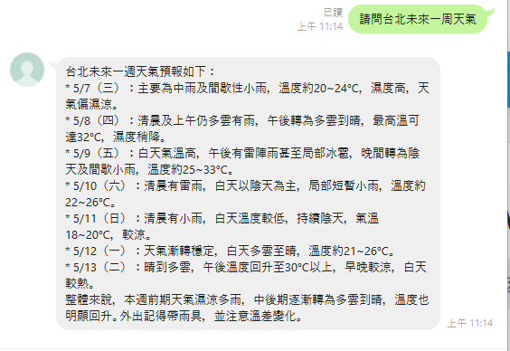

# MCP 與 Weather MCP Server 使用介紹

## 什麼是 MCP？

MCP（Model Context Protocol）是一種協定，用於在工具之間進行通訊與協作。透過 MCP，可以讓各種獨立的工具（如模型、插件、服務）以一致的格式互相交換資料與指令。MCP Server 是提供特定功能的伺服器端程式，能與支援 MCP 的前端進行互動。

## Weather MCP Server 是什麼？

Weather MCP Server 是一個基於 MCP 協定開發的天氣資訊伺服器，利用 [Open-Meteo API](https://open-meteo.com/) 提供免費的天氣資料。透過這個伺服器，你可以查詢：

* 某城市的即時天氣資訊
* 某城市在特定時間範圍內的天氣預報
* 指定時區的目前時間

[mcp_weather_server source code](https://github.com/isdaniel/mcp_weather_server)
[smithery AI](https://smithery.ai/server/@isdaniel/mcp_weather_server)

使用此 MCP Server 搭配 AI Model 可以輕易搭建出即時天氣小助手, 如下我的 AI Bot



---

## 功能特色

* 查詢指定城市的即時天氣
* 查詢指定日期區間的天氣預測
* 查詢目前時間（支援指定時區）

---

## 安裝方式

使用 pip 安裝：

```bash
pip install mcp_weather_server
```

接著，需要在 MCP 設定檔中手動加入 Weather Server 的啟動設定。

### 設定 `cline_mcp_settings.json`

請將以下內容新增到 `cline_mcp_settings.json` 檔案中的 `mcpServers` 區塊：

```json
{
  "mcpServers": {
    "weather": {
      "command": "python",
      "args": [
        "-m",
        "mcp_weather_server"
      ],
      "disabled": false,
      "autoApprove": []
    }
  }
}
```

儲存後，即可在 MCP 架構中啟動並使用 Weather Server。

---

## 使用方式

Weather MCP Server 提供以下三個工具：

### 1. `get_weather`：查詢指定城市目前天氣

**參數說明：**

* `city`（字串，必填）：城市名稱，例如 "Taipei"

**範例：**

```xml
<use_mcp_tool>
<server_name>weather</server_name>
<tool_name>get_weather</tool_name>
<arguments>
{
  "city": "Taipei"
}
</arguments>
</use_mcp_tool>
```

---

### 2. `get_weather_by_datetime_range`：查詢日期區間的天氣預報

**參數說明：**

* `city`（字串，必填）：城市名稱
* `start_date`（字串，必填）：開始日期，格式為 YYYY-MM-DD
* `end_date`（字串，必填）：結束日期，格式為 YYYY-MM-DD

**範例：**

```xml
<use_mcp_tool>
<server_name>weather</server_name>
<tool_name>get_weather_by_datetime_range</tool_name>
<arguments>
{
  "city": "London",
  "start_date": "2024-01-01",
  "end_date": "2024-01-07"
}
</arguments>
</use_mcp_tool>
```

---

### 3. `get_current_datetime`：查詢指定時區目前時間

**參數說明：**

* `timezone_name`（字串，必填）：IANA 時區名稱，例如 "America/New\_York"、"Europe/London"。若未指定，預設為 UTC。

**範例：**

```xml
<use_mcp_tool>
<server_name>weather</server_name>
<tool_name>get_current_datetime</tool_name>
<arguments>
{
  "timezone_name": "America/New_York"
}
</arguments>
</use_mcp_tool>
```

---

## 開發者注意事項

如需在開發或除錯時手動執行 Weather MCP Server，可以直接執行：

```bash
python -m mcp_weather_server
```

---

## 結語

Weather MCP Server 是一個輕量、無需 API 金鑰的天氣資訊服務，適合用於教育、研究或原型開發。透過 MCP 的整合能力，可以輕鬆地將天氣查詢功能加入到各種自動化或智慧應用中。
