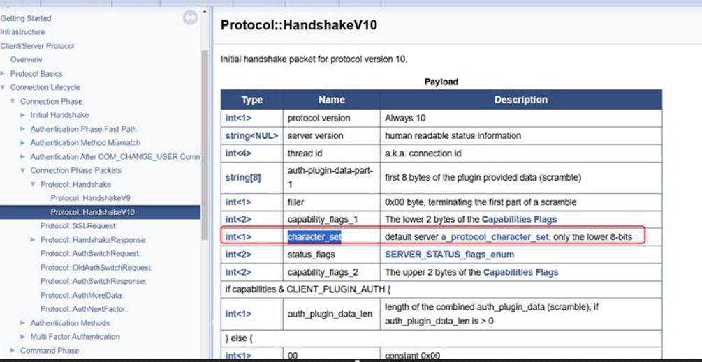
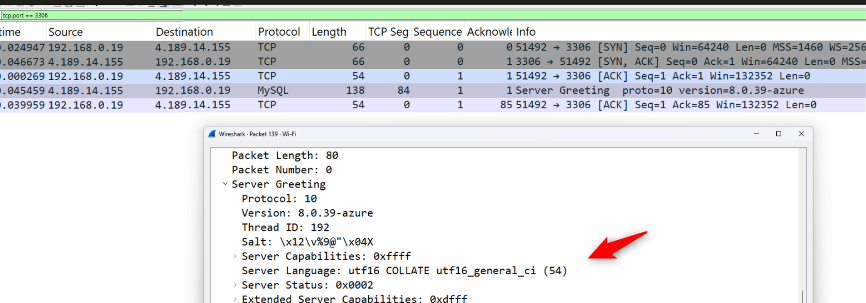
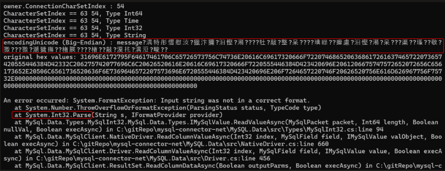

# 為什麼修改 MySQL 的 `character_set_server` 後仍需重啟？從 mysql-connector-net 探討字元集的陷阱

在近期處理一個與 MySQL 字元集相關的問題時，我深入研究了 MySQL Server 的 Handshake 機制以及 `mysql-connector-net` 原始碼，發現了一個容易被忽略但可能會造成重大錯誤的細節——**即使 `character_set_server` 是動態參數，但實際上修改後仍需要重啟 MySQL Server，否則會造成驅動端的解碼錯誤。**


## 問題背景：為什麼驅動程式仍使用舊的字元集？

根據 MySQL Server 的設計，當 client 端連線時，Server 會在 Handshake Initial Packet 中回傳一些基本資訊，其中就包括伺服器的預設字元集（`character_set_server`）。這段資訊是透過以下的程式碼取得：

🔗 [MySQL Source Code 參考連結](https://github.com/mysql/mysql-server/blob/61a3a1d8ef15512396b4c2af46e922a19bf2b174/sql/auth/sql_authentication.cc#L1872)

```c++
packet->append_int1(default_charset_info->number);
```

根據 MySQL 官方文件，這段資訊會被封裝在 Handshake v10 Protocol 中傳送（[官方文件](https://dev.mysql.com/doc/dev/mysql-server/latest/page_protocol_connection_phase_packets_protocol_handshake_v10.html)）。

然而，這個值其實是在 MySQL Server 啟動時就被載入的，**即使你在執行中動態修改 `character_set_server`，重新連線後 greeting packet 裡的字元集值仍然不會更新。**




## 驅動程式的行為：根據 Greeting 決定後續欄位解碼

`mysql-connector-net` 在收到 greeting packet 時，會將字元集儲存在 `ConnectionCharSetIndex`：

```csharp
/* New protocol with 16 bytes to describe server characteristics */
owner.ConnectionCharSetIndex = (int)packet.ReadByte(); // e.g. 54 = UTF16
```
🔗 [連結程式碼位置](https://github.com/mysql/mysql-connector-net/blob/9.1.0/MySQL.Data/src/NativeDriver.cs#L241)

接下來，在處理每個欄位的資料時，若欄位的 charset 為 binary (63)，會 fallback 回 connection 的預設值：

```csharp
if (CharacterSetIndex == 63)
    CharacterSetIndex = driver.ConnectionCharSetIndex;
```

🔗 [欄位處理程式碼位置](https://github.com/mysql/mysql-connector-net/blob/9.1.0/MySQL.Data/src/Field.cs#L250)

這裡的問題就產生了：在 MySQL protocol 中，即使是整數、時間戳等 binary 類型欄位，也會設定 charset 為 binary (63)。這意味著實際 decode 資料時會 fallback 到 UTF-16（預設 greeting 的字元集），導致錯誤解碼，產生亂碼或例外。


## 實驗觀察與錯誤範例

以下是我透過封包擷取與實際執行觀察到的問題：

### Greeting Packet：

在連線時，我們觀察到 greeting charset 設為 54（UTF-16）：

```
Server Greeting
...
    Language: utf16 COLLATE utf16_general_ci (54)
```



### 整數欄位錯誤解析：

欄位的 `characterSet` 是 63 (binary)，fallback 到 54（UTF-16）解碼，造成如下的 `System.FormatException`：

```plaintext
System.FormatException: Input string was not in a correct format.
   at System.Int32.Parse(String s, IFormatProvider provider)
```



因為目前 mysql-connector-net client library 尚未完全支援 UTF16, 未來可能會處理此問題

## 修正建議與討論

### 為什麼需要重啟？

雖然 `character_set_server` 是 dynamic parameter，但 greeting 中的字元集是在啟動時就定義的（由 `default_charset_info` 載入）。因此如果你修改這個參數 **但未重啟 MySQL Server**，那麼新的連線仍然會收到舊的 greeting charset 資訊。

在使用 `mysql-connector-net` 這種驅動時，由於 greeting charset 會被 fallback 作為 binary 欄位的 decode 基準，這會導致我們解析數值型資料時發生錯誤或亂碼。


## 建議改善方向

1. **驅動程式修正建議**：

   * 應該判斷 field type 是否為 binary 前，再決定是否 fallback 到 greeting charset。
   * 例如：對於 Int32、Int64、Timestamp 等欄位，可跳過 charset fallback。

2. **伺服器端操作建議**：

   * 若需更改 `character_set_server`，務必搭配重新啟動 MySQL server，確保 greeting packet 同步更新。
   * 如果您是使用 mysql-connector-net library 請使用 utf8mb4 取代 UTF16


## 總結

這次調查突顯了 MySQL greeting packet 與驅動解碼邏輯間的一個不易察覺的錯誤來源。特別是在使用 `mysql-connector-net` 驅動、並處理 binary 或整數類型資料時，若伺服器端未重新啟動而 greeting charset 未更新，就可能引發解碼錯誤與系統例外。
