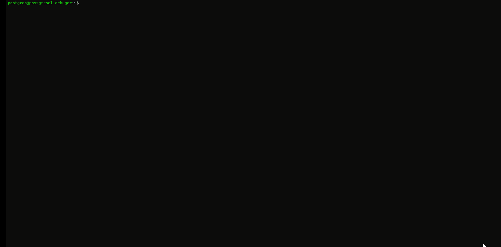

## Foreword

Using gdb for command-line debugging still feels inconvenient. I initially wanted to find a simpler way to directly debug the PostgreSQL source code under Windows. After searching for a while, I found that Visual Studio (VS) was the only option available, but it is heavy and the steps are quite complex. Since most real environments run on Linux, it is better to debug the PostgreSQL source code under Linux.

## How to build & install PostgreSQL from source code.

I used Ubuntu Linux environment, the first step we might need to install pre-requirement tool for PostgreSQL build.

```
sudo apt-get update
sudo apt-get install build-essential libreadline-dev zlib1g-dev flex bison libxml2-dev libxslt-dev libssl-dev libxml2-utils xsltproc ccache libsystemd-dev -y
```

download PostgreSQL source code.

```
wget https://ftp.postgresql.org/pub/source/v14.8/postgresql-14.8.tar.gz
tar xvfz postgresql-14.8.tar.gz
cd postgresql-14.8
```

we would need to make sure the path (`--prefix`) exist in your system.  

```
./configure --prefix=/home/daniel/postgresql-14.8/pgsql --with-icu --with-openssl --with-systemd --with-libxml --enable-debug

make -j 8
make install
```

> we must build with `--enable-debug` parameter, otherwise we can't debug with our source code.

Here are commands we would use later.

```
/home/daniel/postgresql-14.8/pgsql/bin/psql
/home/daniel/postgresql-14.8/pgsql/bin/initdb -D /home/daniel/postgresql-14.8/pgsql/data
/home/daniel/postgresql-14.8/pgsql/bin/pg_ctl -D /home/daniel/postgresql-14.8/pgsql/data -l logfile start
```

## setup PostgreSQL environment path

I would recommend setup PostgreSQL environment path, after we build & install PostgreSQL program from source code that would assist with us easier our next steps.

Identify your shell: Determine which shell you are using by running the following command:

```
echo $SHELL
```

It will display the path to your current shell.

Locate the configuration file: The configuration file you need to modify depends on your shell. Here are the common ones:

* Bash: ~/.bashrc or ~/.bash_profile
* Zsh: ~/.zshrc or ~/.zprofile
* Fish: ~/.config/fish/config.fish

Open the configuration file: Use a text editor, such as nano or vim, to open the configuration file. For example, if you are using Bash and the file is `~/.bashrc`, you can 

```
vim ~/.bashrc
```

please modify with your environment `PGDATA` & `PATH` setting align with your PostgreSQL build bin & data path.

> because my build parameter used `--prefix=/home/daniel/postgresql-14.8/pgsql` so the setting would be align with that. 

```
export PGDATA="/home/daniel/postgresql-14.8/pgsql/data"
export PATH="/home/daniel/postgresql-14.8/pgsql/bin:$PATH"
```

Update the environment: To apply the changes to your current session, run the following command in your terminal:

```
source ~/.bashrc  # or the appropriate file for your shell
```

## build pem file to a create user

To create the keys, a preferred command is ssh-keygen, which is available with OpenSSH utilities.

```bash
ssh-keygen -m PEM -t rsa -b 4096

danielss@postgresql-debuger:~$ ssh-keygen -m PEM -t rsa -b 4096
Generating public/private rsa key pair.
Enter file in which to save the key (/home/danielss/.ssh/id_rsa): /home/danielss/.ssh/danielkey
Created directory '/home/danielss/.ssh'.
Enter passphrase (empty for no passphrase):
Enter same passphrase again:
Your identification has been saved in /home/danielss/.ssh/danielkey
Your public key has been saved in /home/danielss/.ssh/danielkey.pub
```

When you create an Azure VM by specifying the public key, Azure copies the public key (in the .pub format) to the `~/.ssh/authorized_keys` folder on the VM. SSH keys in `~/.ssh/authorized_keys` ensure that connecting clients present the corresponding private key during an SSH connection.

```bash
danielss@postgresql-debuger:~/.ssh$ ll
total 20
drwx------ 2 danielss danielss 4096 Jun  9 02:51 ./
drwxr-xr-x 4 danielss danielss 4096 Jun  9 02:52 ../
-rw-rw-r-- 1 danielss danielss  753 Jun  9 02:51 authorized_keys
-rw------- 1 danielss danielss 3247 Jun  9 02:50 danielkey
-rw-r--r-- 1 danielss danielss  753 Jun  9 02:50 danielkey.pub
```

copy `danielkey` (pem file) to your local machine, then you might login via the pem file.

### permission problem on pem file

Confirm that the permissions of the `.ssh` directory and the authorized_keys file on the server are set correctly. Run the following commands on the server:

```bash
chmod 700 ~/.ssh
chmod 600 ~/.ssh/authorized_keys
```

These commands ensure that the directory has read, write, and execute permissions only for the user, and the `authorized_keys` file has read and write permissions only for the user.

## setup vscode

Please follow below config

> Modify "program" column with PostgreSQL binary file path from json file 

```json
{
    "version": "0.2.0",
    "configurations": [
        {
            "name": "dbg postgresql",
            "type": "cppdbg",
            "request": "attach",
            "program": "/home/daniel/postgresql-14.8/pgsql/bin/postgres",
            "processId": "${command:pickProcess}",
            "MIMode": "gdb",
            "setupCommands": [
                {
                    "description": "Enable pretty-printing for gdb",
                    "text": "-enable-pretty-printing",
                    "ignoreFailures": true
                }
          ]
        }
    ]
}
```

Final used ssh with pem file to login your VM via VsCode.

## demo

Here is the demo for vscode debug PostgreSQL running process by sourcecode.



## How can solve "ptrace:Operation not permitted" problem?

Regarding to [Troubleshoot attaching to processes using GDB](https://github.com/microsoft/MIEngine/wiki/Troubleshoot-attaching-to-processes-using-GDB)

Run the following command as super user: `echo 0| sudo tee /proc/sys/kernel/yama/ptrace_scope`

This will set the ptrace level to 0, after this just with user permissions you can attach to processes which are not launched by the debugger.

```
postgres@postgresql-debuger:~$ echo 0| sudo tee /proc/sys/kernel/yama/ptrace_scope
[sudo] password for postgres:
0
```

More information

https://github.com/microsoft/MIEngine/wiki/Troubleshoot-attaching-to-processes-using-GDB

https://learn.microsoft.com/en-us/azure/virtual-machines/linux/create-ssh-keys-detailed#overview-of-ssh-and-keys